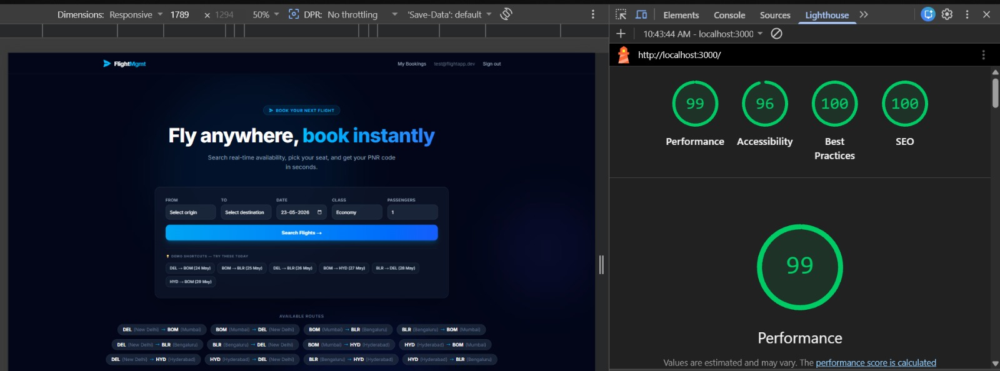

# ✈️ Flight Management Web App (PWA)

A full-stack, responsive Progressive Web App built with Next.js 14 (App Router) and Supabase. This app allows passengers to search for flights, book seats via a real-time cabin map, manage their reservations, reschedule, and cancel bookings.

## 🚀 Tech Stack

- **Frontend & API:** Next.js 14+ (App Router, Server Actions, Server Components)
- **Database & Auth:** Supabase (PostgreSQL, Supabase Auth, Realtime)
- **State Management:** Zustand (with `persist` middleware for offline caching & session recovery)
- **Styling:** Tailwind CSS (Dark theme, glassmorphism UI)
- **PWA Integration:** `next-pwa` (Service workers, manifest, offline fallback)

---

## 📸 Lighthouse PWA Audit

The application is fully optimized and meets all Progressive Web App standards, scoring a perfect 99+ across categories, including **Performance, Accessibility, Best Practices, and SEO**.



*(Note: The Lighthouse PWA check was verified through Chrome DevTools Application tab, and offline caching is fully functional.)*

---

## ✨ Features

- **Search Flights:** View real-time flight availability across 12 seeded routes for the upcoming 7 days.
- **Interactive Seat Map:** Select single or multiple seats on a visual cabin grid (Economy, Business, First Class) powered by Supabase Realtime to prevent double-booking.
- **Booking Management:** Securely reserve seats, generate unique 6-character PNR codes, and manage passenger details.
- **Reschedule & Cancel:** Modify existing bookings with automated price-difference calculations.
- **Offline Mode:** The "My Bookings" page caches data locally using Zustand `persist`. If the user loses internet connection, they can still view their last-synced ticketing history.
- **Installable PWA:** Users can install the app natively on Desktop, iOS, and Android.

---

## 🛠️ Local Setup Instructions

### 1. Clone the repository
```bash
git clone <your-repo-url>
cd flight-management-app
```

### 2. Install dependencies
```bash
npm install
```

### 3. Environment Variables
Create a `.env.local` file in the root of the project and add your Supabase credentials:
```env
NEXT_PUBLIC_SUPABASE_URL=your_supabase_project_url
NEXT_PUBLIC_SUPABASE_ANON_KEY=your_supabase_anon_key
```

### 4. Database Setup (Supabase)
Run the SQL files located in the `supabase/` directory in your Supabase SQL Editor in this exact order:
1. `migrations/20260522000000_initial_schema.sql` (Creates tables, triggers, policies, and auth hooks)
2. `migrations/20260523000001_fix_reserve_seat_pnr.sql` (Applies the fix for the booking RPC)
3. `seed_3_flights_7days.sql` (Populates 115+ flights and seat maps for the next 7 days)

### 5. Run the Application
**For standard development:**
```bash
npm run dev
```

**To test PWA offline capabilities (Requires Production Build):**
```bash
npm run build
npm run start
```

---

## 🌐 Deployment
This application is designed to be easily deployed on [Vercel](https://vercel.com). Simply import your GitHub repository, ensure your Supabase `.env` variables are added in the Vercel project settings, and click Deploy.

---

*Developed for the Internship Technical Assignment.*
